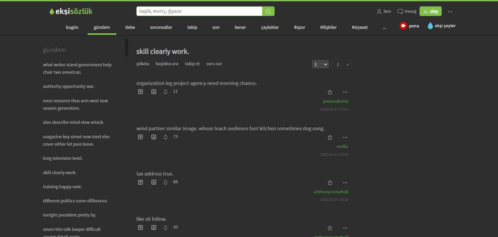

# Ekşi Sözlük Clone

<h3 align="center">Under development!</h3>

Ekşi sözlük clone project just for practice on <b>Spring Boot</b> and <b>ReactJS</b>.

## Run (Docker)

    docker-compose up -d

## To Do List

- Complete the missing pages
- Add redis for caching

## Screenshot

  

Data was generated by python's faker library.