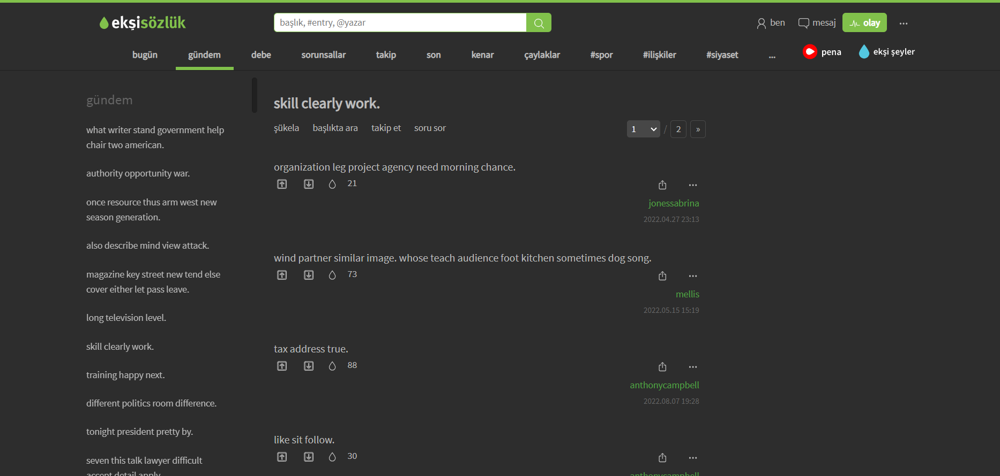

# Ekşi Sözlük Clone

<h3 align="center">Under development!</h3>

Ekşi sözlük clone project just for practice on <b>Spring Boot</b> and <b>ReactJS</b>.

## Run (Docker)

    docker compose up -d

### Populate Database

Wait until the database up, then

    docker exec -i postgres psql -U testuser_eksi -d testdb_eksi -f /sample_data.sql > /dev/null

## To Do List

- Complete the missing pages
- Add redis for caching

## Screenshot

  

Data was generated using Python's Faker library, which is not included in this project, and is provided as an SQL file.
